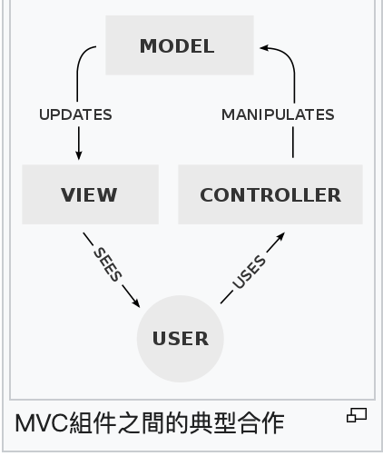
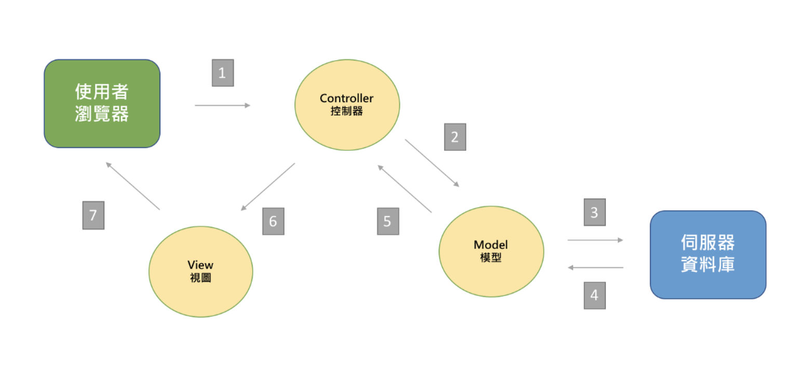

# Why

For me : 

1. 由於支援後端，開發搜尋使用的 API ，原始 library 中採用的是 MVC 架構來分離程式碼，所以覺得有了解的必要
2. MVC (Model, View, Controller) mvc 是一個軟體架構的設計模式，學習設計模式(前人們的經驗歸納)，有助於寫出更好協作和維護的程式碼

# Intro

[[Day 01] 什麼是MVC？能吃嗎？](https://ithelp.ithome.com.tw/articles/10191216)

[MVC - Wiki](https://zh.wikipedia.org/wiki/MVC)

[「筆記」- 何謂 MVC 軟體設計模式](https://medium.com/pierceshih/%E7%AD%86%E8%A8%98-%E4%BD%95%E8%AC%82-mvc-%E8%BB%9F%E9%AB%94%E8%A8%AD%E8%A8%88%E6%A8%A1%E5%BC%8F-af1ff10901e6)

MVC 是一種設計模式(是一種理念，不是一種技術)，主要目的是**簡化應用程式的開發**，**增強程式的可維護性**

# Model 

1. 用於封裝業務邏輯相關的資料以及資料處理方法
2. 對資料具有直接存取的權力(e.g. 對資料庫的存取)
3. Model 不依賴 View & Controller (從設計上直接解耦和)

# View

1. 能夠實現資料有目的的顯示
2. 需要存取對應的資料模型(Model)，因此要是先註冊一份Model

# Controller

1. 控制應用程式流程，處理事件並作出回應(事件包含使用者行為以及data model上的改變)

# Pros

1. 程式碼變簡潔，解耦和
2. 專案開發可以分成三個不同的角色

## Developement - Model

主要由熟悉伺服器端程式語言(PHP/Python/RoR/ASP.Net/Perl...), 資料庫管理與設計, 資訊架構, 演算法, 資料驗證技術等工程師負責

主要建構應用程式運作細節並提供API以及資料互動規則

## Design - View

一般來說負責此部分的是熟悉圖像製作, HTML, CSS 以及 Javascript 的視覺設計人員

## Integration - Controller

主要負責將視覺設計所開發出來的靜態頁面轉換成嵌有城市的動態頁面，將資料利用表單發送到 Model Layer, 接收並轉換 Model Layer 所回傳的資料並呈現在 View Layer 上

# Cons

1. Model 和 View 要嚴格分離，蠻麻煩的
2. 一個要開發的軟體分成三個，必須管理更多文件
3. View -> 使用者看的，Controller --> 使用者引發的事件，Model -> 定義過於廣泛，很多資料處理的邏輯被迫放在這裡，可能會很肥大

# Example - 1

</img>

1. 多個 View 可以共享一個 Model 

   - e.g. 同樣的資料模型，根據Android, Iphone, 網頁版有不同的View，意思是同一個 Model 可以被多個 View 共同使用(提高程式碼可重用性)

2. Controller - 高度獨立，與 Model，View 無關，因此可以方便改變應用程式的資料層以及業務關責

   - e.g. 把資料庫從 MySQL 移植到 Oracle 或 把 RDBMS 改成 LDAP 資料源，只要改 Controller，一旦正確實作 Controller，不管資料源從哪裡來，View都可以正確顯示，且模組互相獨立，改 Controller 不會引響 View和 Model

# Example - 2

</img>

從更實際的角度切入，可以這樣考慮

* Model - 後端資料庫 API
* Controller - 控制 API 資料庫接口的 js
* View - 前端顯示(HTML/CSS)

## Controller

掌握與瀏覽器之間的互動行為，負責收發Request, Response

e.g. Controller 收到請求 --> 通知 Model 調度資料 --> 將資料傳給 View

## Model

使用者想要對資料進行 CRUD 需要透過 Model 中的 js 來操作，例如電商的免運費，計算訂單總額等

## View 

HTNL 樣板 - 如果是動態網站，會按照 Model 取出的資料內容，動態呈現

# NOTE

後記 : 

1. `Controller` 很像 SOLID 中的依賴倒置原則(Dependency Inversion Principle)，過往或許是 View 和 Model 中間常常攪和在一起，導致改一個另一個就要跟著改，所以中間插一個 `Controller` 的抽象層，就可以將 `View`, `Model` 解耦和

2. Web 通常和資料庫的互動是簡單的 CRUD ，當業務邏輯或是計算過於繁複時(例如文章推薦、搜尋結果等)，計算層的 data pipeline 可以放在 data team 的排程中，僅需以計算後的茲料來溝通，如此前後端就可以將複雜的計算邏輯切到其他團隊去